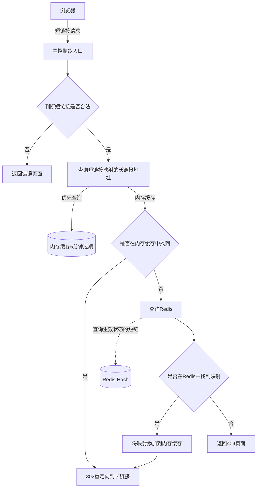
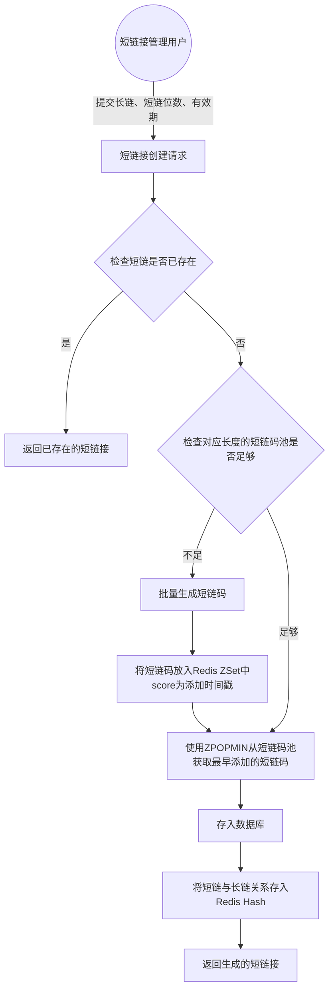
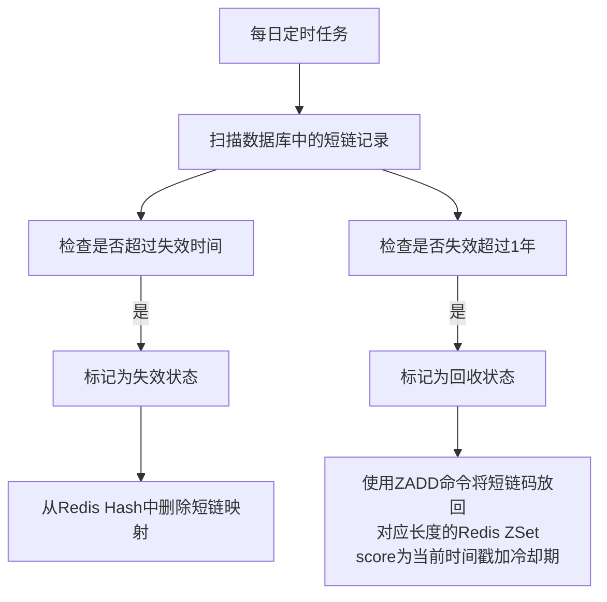
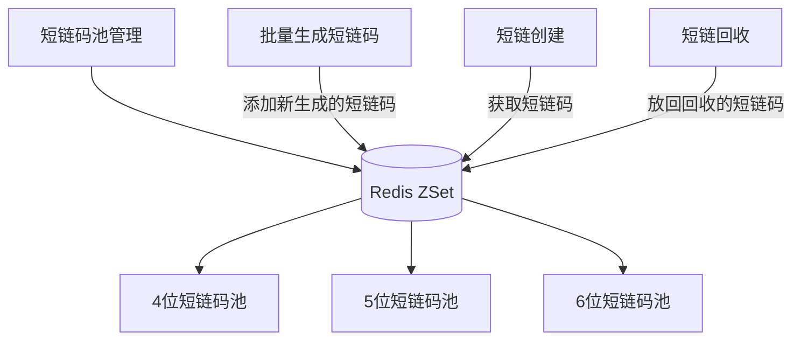
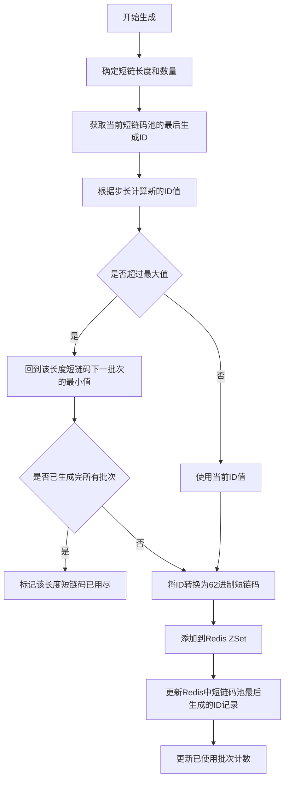

# VShortLink 短链接服务

## 项目简介

VShortLink是一个高性能的短链接服务系统，用于将长URL转换为短URL，便于分享和使用。

## 短链接规则

| 短链长度 | 十进制取值范围 | 62进制取值范围 | 步长 (最大值/每次要生成的id数) | 每次生成多少唯一ID | 可计算次数 (最大值/每次要生成的id数)-1 | 链接建议有效期 | 生成方式 | 说明 |
|---------|-------------|-------------|------|-----------------|----------------------|----------|----------|------|
| 1~3位   | --- | --- | --- | --- | --- | 长期 | 手动配置 | 比如 sl.cc/1111, sl.cc/618 |
| 4位     | (0000) 2382328-14776335 | (0000) 1000-ZZZZ | 14761 | 1000 | 14760 | 长期 | 自动生成 | 长期有效，62进制4位约1400万种组合+0 |
| 5位     | (00000) 147763336-916132831 | (00000) 10000-ZZZZZ | 916217 | 1000 | 916216 | 1年(试用) | 自动生成 | 62进制5位约9亿种组合+0 |
| 6位     | (000000) 916132832-56800235583 | (000000) 100000-ZZZZZZ | 56734392 | 1000 | 56734391 | 临时七天 | 自动生成 | 62进制6位不够的前面补0 |

## 短链接流程

### 短链查询跳转流程

1. 短链接请求进入主控制器入口
2. 判断短链接是否合法
   - 如果不合法，直接返回错误页面
3. 查询短链接映射的长链接地址：
   - **优先从内存缓存中获取**（内存缓存5分钟过期）
   - 如果内存缓存中找到，直接返回302重定向到长链接
   - 如果内存缓存中未找到，则继续查询Redis
4. 在Redis Hash中查询短链接映射的长链接地址（只有生效状态的短链才会存在于Redis Hash中）
   - 如果在Redis中找到映射，将该映射添加到内存缓存，并返回302重定向到长链接
   - 如果未找到（短链处于失效或回收状态），则返回错误页面

### 短链创建流程

每个业务对应一个二级：比如体育、生活、生活hash值、记账等。

1. 短链创建请求处理流程：
   - 用户提交长链接URL、所需短链位数、有效期
   - 系统检查该长链是否已有对应短链
   - 如果已存在，直接返回已有短链

2. 短链码生成与分配流程：
   - 检查对应长度的短链码池是否足够
   - 如果短链码池不足，批量生成一批新的短链码放入Redis ZSet中，score为添加时间戳
   - 使用ZPOPMIN命令从短链码池中获取最早添加的短链码
   - 将短链信息存入数据库，包括短链码、长链URL、创建时间、过期时间等
   - 同时将短链与长链的映射关系存入Redis Hash中，用于快速查询

3. 短链过期处理：
   - 系统根据创建时设置的有效期标记短链的过期时间
   - 过期的短链将通过短链淘汰机制进行处理

4. 短链访问流程：
   - 优先从内存缓存中查询短链接对应的长链接（内存缓存5分钟过期）
   - 如果内存缓存中找到，直接重定向到长链接
   - 如果内存缓存中未找到，则从Redis Hash中查询
   - 如果在Redis中找到（表示短链处于生效状态），将映射添加到内存缓存，并重定向到长链接
   - 如果不存在（表示短链处于失效或回收状态），返回错误页面

## 短链淘汰回收逻辑

短链淘汰回收主要围绕两个核心流程进行处理：

1. **过期失效流程**：处理超过有效期的短链
2. **过期回收流程**：处理失效超过1年的短链码回收

### 过期失效流程

- **触发条件**：短链超过设定的失效时间
- **处理操作**：
  * 将短链状态标记为失效
  * 从Redis Hash中删除短链映射关系，使其无法被访问
  * 在数据库中保留记录，用于统计分析

### 过期回收流程

- **触发条件**：短链失效时间超过1年
- **处理操作**：
  * 将短链状态标记为回收
  * 使用ZADD命令将短链码放回对应长度的Redis ZSet，score为当前时间戳加冷却期
  * 对于高价值的短链码（如4位短链），优先考虑回收重用
  * 对于低价值的短链码（如6位短链），可选择性回收或直接废弃

### 执行机制

- 系统每日定时执行淘汰任务，扫描数据库中的短链记录
- 支持手动触发淘汰任务，用于特殊情况下的即时清理
- 回收的短链码需经过一定冷却期后才能重新分配，避免用户混淆

## 批量添加短链码池

短链码池是系统高效运行的关键组件，用于预先生成并存储可用的短链码，以提高短链创建的响应速度。

### 短链码池存储结构

- **存储结构**：使用Redis ZSet（有序集合）存储短链码池
  * 每种长度的短链码使用独立的ZSet，如`shortlink:pool:4`、`shortlink:pool:5`、`shortlink:pool:6`
  * ZSet的member为短链码，score为添加时间戳
  * 使用ZSet可以按时间顺序获取短链码，确保先进先出，避免频繁使用同一批短链码

### 短链码生成算法

1. **生成流程**：
   - 确定需要生成的短链码长度（4位、5位或6位）和数量
   - 从Redis中获取当前短链码池中该长度的最大ID值（上次生成的最后一个ID）
   - 根据步长计算新的ID范围（最大ID + 1到最大ID + 数量）
   - **ID循环使用机制**：当计算的ID超过该长度短链码的最大值时，回到该长度的最小值继续生成
     * 例如：4位短链码的ID范围是2382328-14776335，如果当前最大ID是14776300，需要生成100个，则生成到14776335后，从2382328继续生成剩余的65个
     * 这种循环机制确保了短链码资源的高效利用，即使在长期运行的系统中也不会耗尽短链码
     * 系统会记录每个长度短链码的循环次数，用于监控和分析使用情况
   - 将十进制ID转换为62进制短链码（使用0-9、a-z、A-Z共62个字符）
   - 对生成的短链码进行合法性检查（过滤敏感词、避免特殊组合等）
   - 将合法的短链码添加到对应长度的Redis ZSet中，score为当前时间戳
   - 更新Redis中该长度短链码池的最后生成ID记录，用于下次生成的起始点

2. **ID记录与管理**：
   - 在Redis中使用key如`shortlink:pool:4:last_id`记录4位短链码的最后生成ID
   - 每次生成完成后更新此记录，确保下次生成从正确的ID开始
   - 使用`shortlink:pool:4:cycle_count`记录4位短链码已循环使用的次数
   - 当ID达到最大值并回到最小值时，循环计数加1
   - 系统会记录每种长度短链码的已使用批次数，当所有批次都用完时（极少发生），标记该长度短链码已用尽
   - 正常情况下，由于短链回收机制的存在，短链码会循环使用，不会出现用尽的情况
   - 系统会定期备份ID记录，确保在Redis故障时能够恢复到正确的生成位置
   - 为防止ID冲突，系统在启动时会检查最后生成ID的有效性，并进行必要的调整

3. **批量生成策略**：
   - 系统定期检查各长度短链码池的剩余数量
   - 当剩余数量低于阈值时（如4位短链码池少于100个），触发批量生成
   - 批量生成的数量根据不同长度短链码的使用频率动态调整
   - 4位短链码每次生成1000个，5位短链码每次生成1000个，6位短链码每次生成1000个

4. **短链码获取与回收**：
   - 创建短链时，使用ZPOPMIN命令从对应长度的ZSet中获取最早添加的短链码
   - 回收短链码时，使用ZADD命令将短链码放回对应长度的ZSet，score为当前时间戳加冷却期
   - 冷却期确保回收的短链码不会立即被重新分配，避免用户混淆

## 技术实现

1. 存储架构：
   - 使用MySQL/PostgreSQL存储短链基本信息和状态
   - 使用内存缓存（5分钟过期）作为第一级缓存，提供最快的查询响应
   - 使用Redis Hash存储短链与长链的映射关系，作为第二级缓存
   - 使用Redis ZSet维护不同长度的短链码池，按时间戳排序

2. 短链生成机制：
   - 采用分布式ID生成算法，确保生成的短链码唯一
   - 预生成短链码并存入Redis池中，提高创建短链的响应速度
   - 支持不同长度短链码的生成和管理（4位、5位、6位等）

3. 短链淘汰与回收机制：
   - 在数据库中记录短链的创建时间和失效时间
   - 通过定时任务执行两个核心流程：
     * **过期失效流程**：超过失效时间的短链从Redis Hash中删除（内存缓存会自动过期，无需额外处理）
     * **过期回收流程**：失效超过1年的短链码放回短链码池
   - 支持根据不同长度的短链设置不同的默认有效期
   - 实现短链码回收机制，高效利用有限的短链资源
   - 内存缓存采用LRU策略，自动淘汰最近最少使用的短链映射，并设置5分钟过期时间
   - 提供短链使用和回收的统计分析功能，优化资源分配策略

4. 接口与功能：
   - 提供RESTful API接口，支持创建、查询、删除短链
   - 支持批量生成短链接
   - 提供短链使用统计和分析功能

## 使用说明

待补充

## 贡献指南

待补充

## 许可证

本项目采用Apache 2.0许可证。详情请参阅[LICENSE](LICENSE)文件。